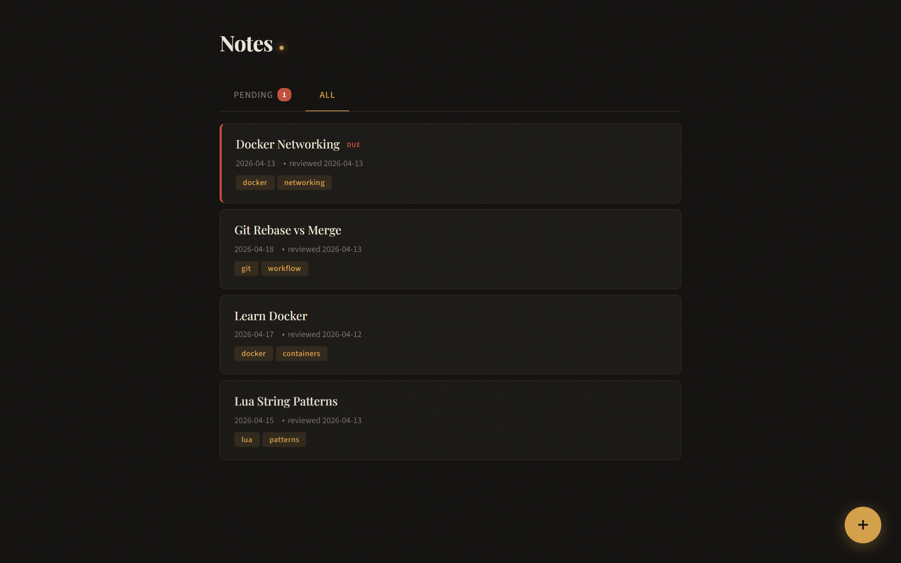
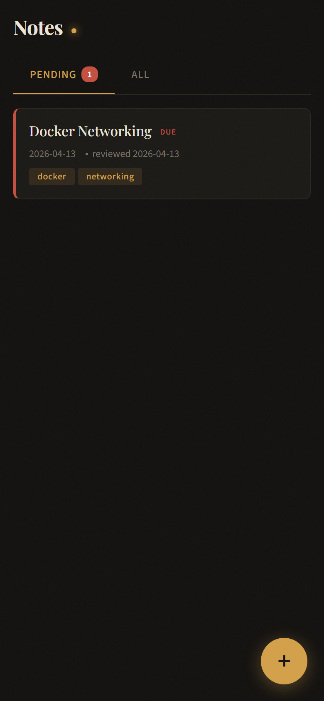
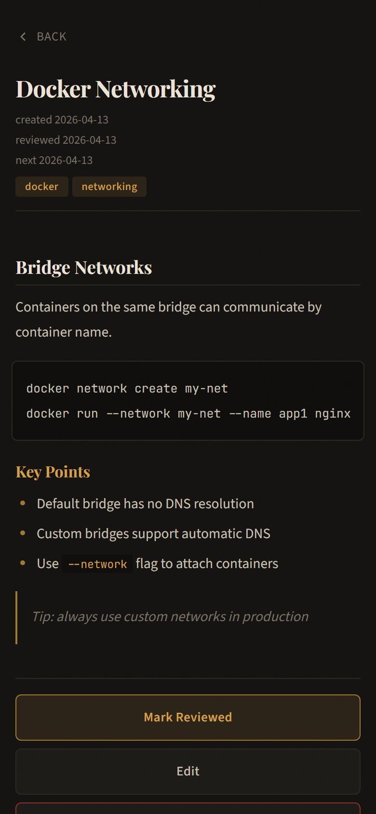
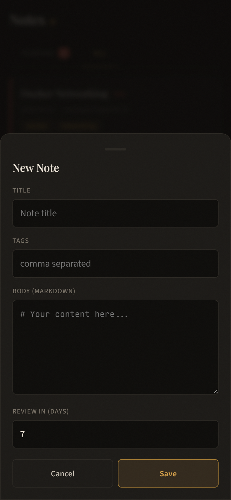
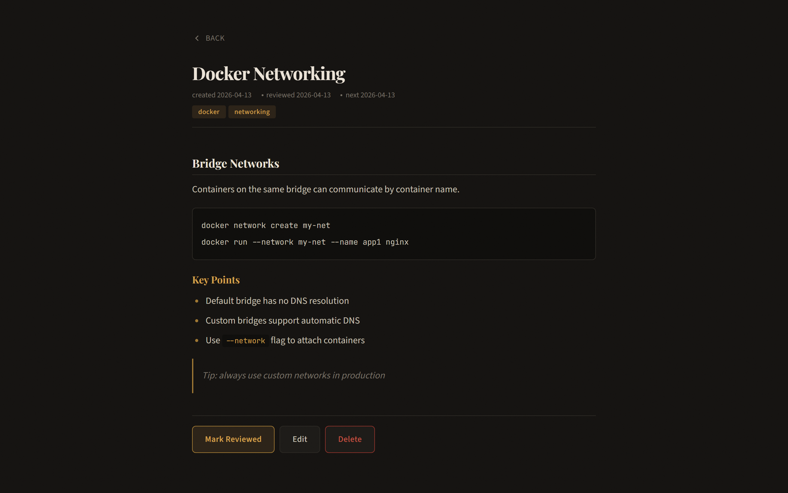

# note-todo-work

A Docker-based spaced repetition system for markdown notes. Store `.md` files with review metadata, get notified when notes are due for review.

Built with OpenResty (Nginx + Lua) - single container, no dependencies.



## Features

- **CRUD API** for markdown notes with frontmatter metadata
- **Spaced repetition** - each note tracks `last_review` and `next_review` dates
- **Pending review endpoint** - get all notes due for review today
- **Markdown rendering** - full GFM support in the PWA (headings, code blocks, tables, blockquotes)
- **Mobile-first PWA** - installable, touch-optimized, works offline-ready
- **API key auth** - optional, via `.env`
- **File-based storage** - notes are plain `.md` files in a Docker volume
- **No database** - just Nginx + Lua + filesystem

## Screenshots

<p align="center">
  
  
  
</p>

<p align="center">
  
</p>

## Quick Start

```bash
# Clone
git clone https://github.com/enixCode/note-todo-work.git
cd note-todo-work

# Copy env file
cp .env.example .env

# Run (local dev with port binding)
docker compose -f docker-compose.yml -f docker-compose.dev.yml up --build -d

# Open http://localhost:8090
```

## API

All endpoints return JSON. When `API_KEY` is set in `.env`, pass it via `X-Api-Key` header or `?api_key=` query param.

| Method | Route | Description |
|--------|-------|-------------|
| `GET` | `/notes` | List all notes (metadata only) |
| `GET` | `/notes/:id` | Get a single note (metadata + rendered body) |
| `POST` | `/notes` | Create a note |
| `PUT` | `/notes/:id` | Update a note |
| `DELETE` | `/notes/:id` | Delete a note |
| `PATCH` | `/notes/:id/review?days=N` | Mark reviewed, bump `next_review` by N days (default 7) |
| `GET` | `/notes/review/pending` | Get all notes where `next_review <= today` |

### Create a note

```bash
curl -X POST http://localhost:8090/notes \
  -H "Content-Type: application/json" \
  -d '{"title": "My Note", "body": "# Hello\nSome content.", "tags": "tag1,tag2", "review_days": 7}'
```

### Mark as reviewed

```bash
curl -X PATCH "http://localhost:8090/notes/my-note/review?days=14"
```

### Get pending reviews

```bash
curl http://localhost:8090/notes/review/pending
```

## Note format

Notes are stored as `.md` files with YAML frontmatter:

```markdown
---
title: My Note
created: 2026-04-13
last_review: 2026-04-13
next_review: 2026-04-20
tags: docker,lua
---

# Content here
Your markdown content...
```

## Configuration

| Variable | Default | Description |
|----------|---------|-------------|
| `API_KEY` | _(empty)_ | API key for auth. Empty = open access |

## Deploy

The `docker-compose.yml` is clean (no port bindings, no Traefik labels) - ready for reverse proxy setups like Traefik, Nginx, or Caddy.

```bash
# Production
docker compose up --build -d
```

The container exposes port `8080` internally. Mount a reverse proxy in front, or use `docker-compose.dev.yml` for local development with port `8090`.

## Architecture

```
note-todo-work/
  Dockerfile              # OpenResty Alpine
  docker-compose.yml      # Production (no ports)
  docker-compose.dev.yml  # Dev override (port 8090)
  .env.example            # Environment template
  nginx/
    nginx.conf            # Routes + static files + Lua handlers
  lua/
    auth.lua              # API key check
    frontmatter.lua       # Parse/serialize YAML frontmatter
    notes.lua             # CRUD + review logic
  static/
    index.html            # Mobile-first PWA
    manifest.json         # PWA manifest
    sw.js                 # Service worker (network-first)
    icon.svg              # App icon
  data/                   # Volume mount for .md files
```

## Tech stack

- **OpenResty** (Nginx + LuaJIT) - serves API and PWA from a single container
- **Lua** - frontmatter parsing, CRUD, review logic
- **marked.js** - client-side markdown rendering
- **Playfair Display** - editorial serif typography
- **Docker** - single container, ~60MB image

## License

MIT
